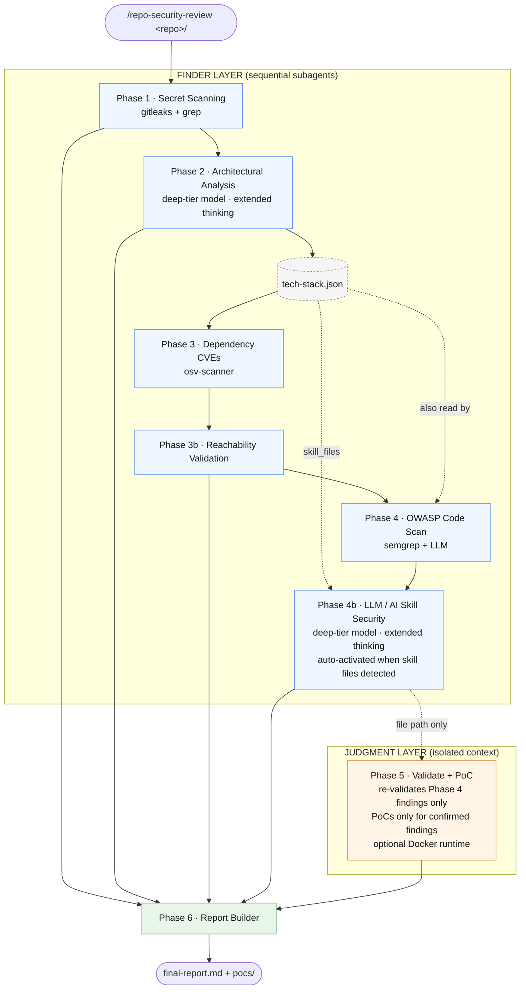

# repo-security-review

A Claude Code **skill** that runs a full, multi-phase security review of a code repository — secret scanning, architecture and threat analysis, dependency CVEs, OWASP code review, and independent validation — then writes a single markdown report. Each phase runs as an isolated subagent, and findings pass through a finder → judgment trust boundary before they reach the report.

Works on a single repo or across multiple microservices, and has a dedicated mode for auditing third-party/open-source tools before adopting them.

> Full specification: [SKILL.md](SKILL.md).

---

## Installation

Skills live under `~/.claude/skills/`. Clone the repo there so updates are a `git pull` away:

```bash
mkdir -p ~/.claude/skills
git clone https://github.com/<your-org>/repo-security-review ~/.claude/skills/repo-security-review
```

Install the external scanners the phases use (`gitleaks`, `osv-scanner`, `semgrep`, `jq`, and optionally `docker` for `--runtime`):

```bash
bash ~/.claude/skills/repo-security-review/scripts/setup.sh
```

The script installs whatever it can via `brew`, `go`, or `pip3`. Any missing tool just degrades the matching phase — the pipeline never aborts. To update later: `cd ~/.claude/skills/repo-security-review && git pull`.

---

## Usage

In any Claude Code session (CLI or Desktop), point the skill at a local repo path:

```text
/repo-security-review /path/to/repo
```

### Sample commands

```text
# Skip phases you don't need, copy the report somewhere
/repo-security-review /path/to/repo --skip secrets,dependencies --output ~/reports/myapp

# Full detailed report (OWASP coverage, remediation priority, appendix)
/repo-security-review /path/to/repo --verbose

# Runtime PoC validation in Docker
/repo-security-review /path/to/repo --runtime

# CI / headless — validation only (no PoC files), no prompts
/repo-security-review . --output ./security-report --skip poc --yes

# Calibrate severity for a local-only tool behind auth
/repo-security-review /path/to/repo --context deployment_target=local,auth_required_to_reach=true

# Multi-repo — analyze several services, get a system-level report
/repo-security-review --repos ~/svcs/auth,~/svcs/gateway,~/svcs/users --output ~/reports/my-system

# Vendor audit — is this third-party/open-source tool safe to adopt internally?
/repo-security-review /path/to/vendor-tool --vendor --output ~/reports/vendor-tool
```

### Flags

| Flag | Default | Effect |
|------|---------|--------|
| `--repos <paths>` | none | Comma-separated repo paths → multi-repo mode (adds cross-service topology + synthesis). |
| `--skip <phases>` | none | Comma-separated: `secrets`, `architecture`, `dependencies`, `owasp`, `skill-security`, `validation`, `poc`. |
| `--output <dir>` | none | Copy the report and PoC scripts into this directory after the run (created if needed). |
| `--verbose` | off | Full detailed report (OWASP checks inventory, remediation-priority section, appendix). |
| `--runtime` | off | Stand the app up in Docker and run each confirmed PoC against it. |
| `--vendor` | off | Third-party adoption audit. Skips secrets/dependencies/PoC, pins all phases to Sonnet, and produces an adoption-risk report (verdict + conditions + "what it does" + adopter-side controls). |
| `--context <pairs>` | none | Inline threat model to calibrate severity: `deployment_target=local\|public`, `auth_required_to_reach=true\|false`. Softens only — never sharpens. |
| `--claude5` | off | Opt into Claude 5 generation models (with 4.x fallback). By default uses pinned 4.x versions. |
| `--yes` | off | Non-interactive / CI mode — auto-confirms prompts (safety path checks still apply). |
| `--debug` | off | Write `.security-review/execution-log.md` showing how the file-reading phases actually ran. |
| `--help` | — | Show usage. |

**Skip cascades** (applied silently): `--skip owasp` also skips `validation` + `poc`; `--skip validation` also skips `poc`; `--skip poc` keeps validation but writes no PoC files; `--skip architecture` also skips `skill-security`. `--vendor` forces skip of `secrets`, `dependencies`, and `poc`.

### Output

Working artifacts go to `<repo>/.security-review/` (per-phase JSON, `pocs/`, and `final-report.md`); `--output` copies the report + PoCs out. In multi-repo mode, start from `system-report.md` in the output directory.

---

## Phase flow


