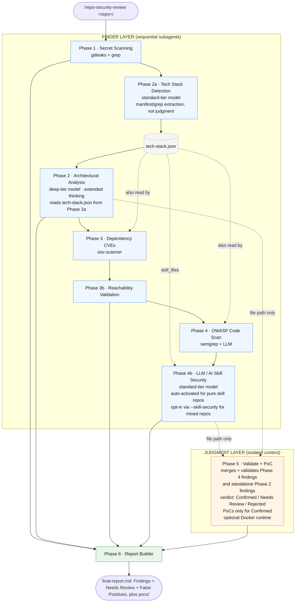

# repo-security-review

A Claude Code **skill** that runs a full, multi-phase security review of a code repository — secret scanning, architecture and threat analysis, dependency CVEs, OWASP code review, and independent validation — then writes a single markdown report. Each phase runs as an isolated subagent, and findings pass through a finder → judgment trust boundary before they reach the report.

Works on a single repo or across multiple microservices, has a dedicated mode for auditing third-party/open-source tools before adopting them, and a fast diff-scoped mode for reviewing a single pull request without scanning the whole repo first.

> Full specification: [SKILL.md](SKILL.md).

---

## Installation

Skills live under `~/.claude/skills/`. Clone the repo there so updates are a `git pull` away:

```bash
mkdir -p ~/.claude/skills
git clone https://github.com/<your-org>/repo-security-review ~/.claude/skills/repo-security-review
```

Install the external scanners the phases use (`gitleaks`, `osv-scanner`, `semgrep`, `jq`, `curl` for `--verify-deployment`, and optionally `docker` for `--runtime` — `playwright`+Chromium is also optional and used automatically by `--runtime`/`--verify-deployment` when a check needs a browser, no separate flag):

```bash
bash ~/.claude/skills/repo-security-review/scripts/setup.sh
```

The script installs whatever it can via `brew`, `go`, or `pip3`. Any missing tool just degrades the matching phase — the pipeline never aborts. To update later: `cd ~/.claude/skills/repo-security-review && git pull`.

---

## Usage

In any Claude Code session (CLI or Desktop), point the skill at a local repo path:

```text
/repo-security-review /path/to/repo
```

### Sample commands

```text
# Skip phases you don't need, copy the report somewhere
/repo-security-review /path/to/repo --skip secrets,dependencies --output ~/reports/myapp

# Generate and keep a PoC script for confirmed findings (not executed)
/repo-security-review /path/to/repo --poc

# Dynamically verify eligible findings against Docker — strengthens/softens
# verdicts; tool (curl vs. headless browser) chosen automatically per finding
# type. Exploit is discarded after use — add --poc to also keep it in pocs/
/repo-security-review /path/to/repo --runtime

# CI / headless — PR-diff review, no prompts, no full-repo scan needed first
/repo-security-review . --pr origin/main --output ./pr-security-report --yes

# Calibrate severity for a local-only tool, and verify the real deployment is auth-gated
/repo-security-review /path/to/repo --local --verify-deployment https://app.example.com

# Dynamically verify AND keep the PoC scripts (including any XSS/CSRF/
# clickjacking findings, browser-driven automatically)
/repo-security-review /path/to/repo --runtime --poc

# Multi-repo — analyze several services, get a system-level report
/repo-security-review --repos ~/svcs/auth,~/svcs/gateway,~/svcs/users --output ~/reports/my-system

# Vendor audit — is this third-party/open-source tool safe to adopt internally?
/repo-security-review /path/to/vendor-tool --vendor --output ~/reports/vendor-tool

# PR review — diff-scoped, no full-repo scan required first
/repo-security-review /path/to/repo --pr main...feature/add-export
```

### Flags

| Flag | Default | Effect |
|------|---------|--------|
| `--repos <paths>` | none | Comma-separated repo paths → multi-repo mode (adds cross-service topology + synthesis). |
| `--skip <phases>` | none | Comma-separated: `secrets`, `architecture`, `dependencies`, `owasp`, `skill-security`, `validation`. |
| `--output <dir>` | none | Copy the report and PoC scripts into this directory after the run (created if needed). |
| `--poc` | off | Opt-in: persist the constructed exploit for each finding Phase 5 confirms as a durable script under `pocs/`. Independent of `--runtime` — doesn't execute anything by itself. |
| `--runtime` | off | Opt-in: dynamically verify eligible findings against the app stood up in Docker (curl or headless browser, chosen automatically per finding type). A clean result can strengthen or soften the verdict. No longer implies `--poc` — the exploit is discarded after use unless `--poc` is also set. |
| `--vendor` | off | Third-party adoption audit. Skips secrets/dependencies, forces PoC generation off, pins all phases to Sonnet, and produces an adoption-risk report (verdict + conditions + "what it does" + adopter-side controls). |
| `--pr <base>...<head>` | none | PR review mode. Reviews only a pull request's diff — no full-repo scan needed first. `--pr <base>` is shorthand for `<base>...HEAD`. Pins to Sonnet, writes `pr-report.md`. Mutually exclusive with `--repos` and `--vendor`. Needs the base branch's history available locally to compute the diff — a shallow/single-branch checkout (GitHub Actions' default) isn't enough; fetch full history (`fetch-depth: 0`) plus the base ref explicitly (`git fetch origin <base>`) before running in CI. |
| `--local` | off | Assert this is a local-only tool, not a publicly reachable service — softens severity by −2 tiers. Omit for the pessimistic default (`public`). |
| `--verify-deployment <url>` | none | Opt-in: send one live, passive HTTP check to a real deployment URL so Phase 5 derives `auth_required_to_reach` from an actual observation (login/SSO redirect, WAF challenge) instead of a declared claim. Also collects a few cheap TLS/security-header posture checks (HSTS/CSP/cookie flags, negotiated TLS version+cipher, weak-protocol acceptance) that corroborate matching Phase 4 findings — not a Qualys-style grading pass, just ground truth for existing findings. If the gating check is inconclusive, automatically escalates to a headless-browser recheck (no separate flag). Gated behind confirmation prompt(s) (`--yes` auto-confirms). |
| `--yes` | off | Non-interactive / CI mode — auto-confirms prompts (safety path checks still apply). |
| `--cost` | off | Write `.security-review/cost-report.md` — duration and estimated token consumption for every phase that ran (and named subphases, e.g. 3b, Phase 5's Exploit Construction/Dynamic Verification parts). Renamed from `--debug`; no longer includes file-read/coverage/checks detail. |
| `--sonnet` | off | Apply Sonnet instead of Opus for phase2 to save some tokens in default scan mode. Often increases false negative and decreases false positive.|
| `--skill-security` | off | Opt-in: run Phase 4b (LLM/AI skill security) on a mixed repo that also contains a `SKILL.md`/`.claude/commands/`. Without it, a mixed repo never runs Phase 4b by default — just having those files present isn't reason enough, since ordinary `CLAUDE.md`/`AGENTS.md` docs are common in AI-assisted projects. Redundant on a repo that's *entirely* skill/agent content (Phase 4b auto-runs there regardless) and in `--vendor` mode (already auto-runs it). |
| `--help` | — | Show usage. |

**Skip cascades** (applied silently): `--skip owasp` also skips `validation` (nothing left to validate); `--skip validation` means `--poc` and `--runtime` both have no effect (no findings to construct an exploit for); `--skip architecture` also skips `skill-security`. `--vendor` forces skip of `secrets` and `dependencies`, and forces PoC generation off regardless of `--poc`. In `--pr` mode the same skip names apply but target its own steps instead of numbered phases, and `architecture` cannot be skipped (its diff-scoped context is load-bearing for every other step); `--poc`/`--runtime` have no effect in `--pr` mode.

### Output

Working artifacts go to `<repo>/.security-review/` (per-phase JSON, `pocs/`, and `final-report.md`); `--output` copies the report + PoCs out. In multi-repo mode, start from `system-report.md` in the output directory. In `--pr` mode, artifacts use `pr-`-prefixed filenames (`pr-findings.json`, `pr-validated.json`, `pr-report.md`) so they never collide with a prior or later full scan's output in the same repo.

---

## CI usage (GitHub Actions)

`--pr` mode is the fit for CI — it reviews only the pull request's diff, so
it doesn't need a prior full-repo scan. Combine with `--yes` to auto-confirm
every gate. Authentication is a Claude Code CLI concern, not a skill flag:
set `ANTHROPIC_API_KEY` as a repo/org secret and export it in the job
environment.

```yaml
name: Security Review (PR)

on:
  pull_request:
    branches: [main]

jobs:
  repo-security-review:
    runs-on: ubuntu-latest
    steps:
      - uses: actions/checkout@v4
        with:
          fetch-depth: 0   # --pr diffs against the base branch; needs its history

      - name: Fetch base branch
        run: git fetch origin ${{ github.event.pull_request.base.ref }}

      - uses: actions/setup-node@v4
        with:
          node-version: '20'

      - name: Install Claude Code CLI
        run: npm install -g @anthropic-ai/claude-code

      - name: Install skill + external scanners
        run: |
          mkdir -p ~/.claude/skills
          git clone https://github.com/<your-org>/repo-security-review ~/.claude/skills/repo-security-review
          bash ~/.claude/skills/repo-security-review/scripts/setup.sh

      - name: Run PR security review
        env:
          ANTHROPIC_API_KEY: ${{ secrets.ANTHROPIC_API_KEY }}
        run: |
          claude -p "/repo-security-review . --pr origin/${{ github.event.pull_request.base.ref }} --yes --output ./pr-security-report"

      - name: Upload report
        uses: actions/upload-artifact@v4
        with:
          name: pr-security-report
          path: ./pr-security-report
```

---

## Phase flow



PR review mode (`--pr`) is a separate, single-agent mode — not a variant of
the pipeline above. It never runs Phases 1–4 or 7; it runs
`references/pr-review.md` directly (Steps 0–5 gather diff-scoped context and
scan, Step 6 validates in isolation, Step 7 writes `pr-report.md`), bounding
file reads to the diff plus whatever a repo-wide grep specifically points to.
