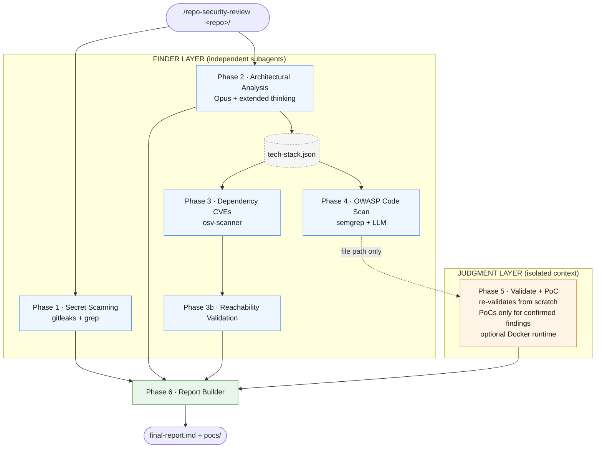

# repo-security-review

A Claude Code **skill** that runs a full, multi-phase security review of a code repository. Each phase runs as an isolated subagent with a narrow responsibility, and findings flow through a strict finder → judgment trust boundary before a final report is produced.

See [SKILL.md](SKILL.md) for the full specification.

---

## What it does

Seven sequential phases:

1. **Secret scanning** — `gitleaks` across full git history
2. **Architectural analysis** — trust boundaries, auth model, infra config; produces a tech-stack profile that gates downstream phases
3. **Dependency CVE scanning** (+ 3b reachability) — `osv-scanner` against ecosystems detected in Phase 2
4. **Code-level OWASP analysis** — Top 10 + API Top 10, pruned by tech stack (no DB → skip SQLi, etc.)
5. **Finding validation + PoC generation** — independent re-validation of Phase 4 candidates; PoCs written only for findings that pass the gate (optional Docker runtime validation)
6. **Report builder** — aggregates everything into a single markdown report with severity matrix, remediation table, false-positives log, and PoC scripts

---

## Prerequisites

External CLI tools used by the phases:

| Tool | Used by | Required? |
|------|---------|-----------|
| `gitleaks` | Phase 1 | Recommended |
| `osv-scanner` | Phase 3 | Recommended |
| `semgrep` | Phase 4 | Recommended |
| `docker` | Phase 5 (`--runtime` only) | Optional |

If a tool is missing, the corresponding phase runs in a degraded mode and the report notes the limitation — the pipeline never aborts because of a missing tool.

---

## Install

Skills live under `~/.claude/skills/` (user-level, available in both the Claude Code CLI and the Desktop app). Clone the repo straight into that directory so updates are a `git pull` away:

```bash
mkdir -p ~/.claude/skills
git clone https://github.com/<your-org>/repo-security-review ~/.claude/skills/repo-security-review
```

Then install the external tools:

```bash
bash ~/.claude/skills/repo-security-review/scripts/setup.sh
```

The script detects `brew`, `go`, or `pip3` and installs whatever it can. It will also flag Docker as missing if you plan to use `--runtime`.

To update later:

```bash
cd ~/.claude/skills/repo-security-review && git pull
```

---

## Usage

In any Claude Code session (CLI or Desktop), invoke the skill on a local repository path:

```text
/repo-security-review /path/to/repo
```

### Common options

```text
/repo-security-review /path/to/repo --skip secrets,dependencies
/repo-security-review /path/to/repo --output ~/reports/myapp.md
/repo-security-review /path/to/repo --runtime
/repo-security-review /path/to/repo --skip architecture --output ~/reports/myapp.md --runtime
```

| Flag | Default | Effect |
|------|---------|--------|
| `--skip <phases>` | none | Comma-separated: `secrets`, `architecture`, `dependencies`, `owasp`, `validation` |
| `--output <path>` | `~/security-reports/<repo>-<date>.md` | Final report destination |
| `--runtime` | off | Docker-based runtime PoC validation in Phase 5 |
| `--help` | — | Show usage |

**Cascade rules** (applied silently):
- `--skip owasp` → also skips `validation` (nothing to validate)
- `--skip validation` → PoC is skipped too (it lives inside Phase 5)

### Casual phrasings

The skill is also triggered by natural-language requests like:

- "Run a security review on `~/repos/my-service`"
- "Check this repo for OWASP issues"
- "Audit dependencies and secrets in this codebase"

---

## When to run

This skill is built for **periodic, deep, whole-repo reviews** — not per-PR CI. Its value comes from full git-history secret scanning, architecture-level reasoning, and cross-file data flow analysis, all of which are wasted when scoped to a single PR diff. Running it on every commit also burns tokens analyzing files the change never touched.

Good moments to trigger it:

- **Release candidates / pre-launch** — strongest signal-to-cost; you can still fix what it finds before shipping
- **Scheduled cadence** (weekly or monthly via cron or a GitHub Action) — catches dependency drift as new CVEs are published, even when code hasn't changed
- **Major dependency upgrades or framework migrations** — surface area shifts faster than per-PR scans can track
- **Before a pentest, or post-incident** — useful as a baseline or root-cause companion
- **Before open-sourcing or sharing a repo externally** — last-line check for secrets, sensitive data, and obvious flaws

**Complementary pattern:** pair this skill with Claude Code's built-in `/security-review` (diff-scoped) for per-PR coverage in CI. The built-in command catches regressions on the PR's actual diff cheaply and quickly; `repo-security-review` catches systemic and accumulated issues on a slower cadence. Together they cover the spectrum without duplicating cost.

---

## Phase flow



**Key invariants of the flow:**

- Phase 2's `tech-stack.json` gates Phases 3 and 4 — irrelevant checks (e.g. SQLi when there is no DB, API Top 10 when the project is not an API) are skipped automatically.
- The arrow from Phase 4 to Phase 5 is **file-path only**. Phase 5 reads `phase4-owasp.json` as untrusted input and re-validates each finding from scratch — this is the trust boundary that filters false positives.
- PoC generation is gated *inside* Phase 5: a finding that fails validation never gets a PoC.
- Phase 6 always runs (even if upstream phases were skipped) and notes what was skipped and why.

---

## Output

Working artifacts are written to `/tmp/repo-security-review-<repo-name>/`:

```text
/tmp/repo-security-review-<name>/
├── tech-stack.json
├── phase1-secrets.json
├── phase2-architecture.json
├── phase3-cves.json
├── phase3b-reachability.json
├── phase4-owasp.json
├── phase5-validated.json
├── phase5-pocs.json
├── pocs/
│   ├── poc_O-001.py
│   └── poc_O-002.sh
└── final-report.md
```

At the end of the run, `final-report.md` is copied to the `--output` path (and the `pocs/` directory alongside it, if any PoCs were generated).

---

## Repository layout

```text
repo-security-review/
├── SKILL.md                  # Skill specification (read by Claude Code)
├── references/               # Per-phase agent instructions
│   ├── phase1-secrets.md
│   ├── phase2-architecture.md
│   ├── phase3-dependencies.md
│   ├── phase4-owasp.md
│   ├── phase5-validate-and-poc.md
│   └── phase6-report.md
├── scripts/
│   ├── repo-security-review-command.md   # Slash-command definition
│   └── setup.sh                          # Installs gitleaks, osv-scanner, semgrep
└── assets/                   # (reserved for future templates/diagrams)
```

---

## Runtime PoC validation (`--runtime`)

When `--runtime` is set, Phase 5 stands the app up in Docker and executes each confirmed PoC against it. There are three paths, picked in order:

1. **Project's `docker-compose.yml`** — used as-is.
2. **Project's `Dockerfile`** — built and run on the port detected by Phase 2.
3. **Synthesized environment** — if neither file exists, Phase 5 generates a minimal `Dockerfile` (and a `docker-compose.yml` with a DB sidecar if the project uses one) from the tech-stack profile, and runs the PoC against that.

Synthesized files are written to `/tmp/repo-security-review-<repo>/synthesized/` and **persist after the run** so you can re-run validation later (`cd synthesized/ && docker compose up`).

**Limits of the synthesized path — be aware before trusting the result:**

- Covers stateless web apps on common stacks (Flask, FastAPI, Django, Express, Next.js, Go, Rails). Unsupported stacks fall back to `RUNTIME_SKIPPED`.
- A single supported DB (Postgres / MySQL / MongoDB / Redis) is synthesized as a sidecar with default credentials. Multi-DB or exotic dependencies (Elasticsearch, Kafka, custom services) are not synthesized — `RUNTIME_SKIPPED`.
- The synthesized DB comes up **empty** — no migrations beyond what the Dockerfile runs, no seed users. PoCs that require pre-existing accounts or records (BOLA, broken auth, IDOR) will fail at the login step and are reported as `RUNTIME_NOT_CONFIRMED` with a note explicitly flagging the seed-data limitation, so you don't mistake a setup failure for evidence of safety.
- Runtime-confirmed findings against a synthesized environment are labeled as such in the final report — they're a strong signal, but not a substitute for running the PoC against the project's real setup.

If you don't need runtime confirmation, omit `--runtime`. The PoCs are still real, runnable scripts you can execute manually against any live instance later.

---

## Troubleshooting

- **"Skill not found"** — verify the clone path is exactly `~/.claude/skills/repo-security-review/` and that `SKILL.md` sits at its root.
- **Phase 1 reports nothing** — check `gitleaks version`; if missing, rerun `scripts/setup.sh`.
- **Phase 3 misses ecosystems** — Phase 2 may have under-detected the tech stack. Re-run without `--skip architecture`.
- **`--runtime` does nothing** — confirm `docker --version` works and Docker Desktop is running.
- **`--runtime` produces `RUNTIME_SYNTHESIS_FAILED`** — the repo had no Docker setup and synthesis tried but failed. Check `/tmp/repo-security-review-<repo>/synthesized/startup.log` for the build/startup log.
